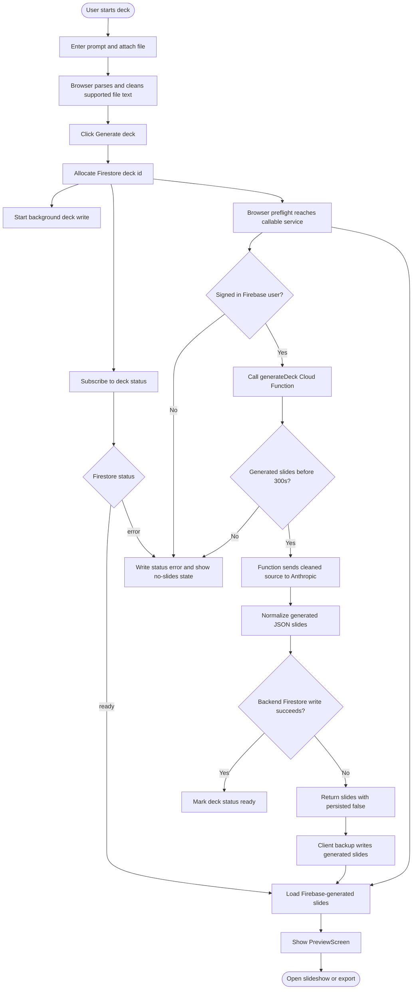
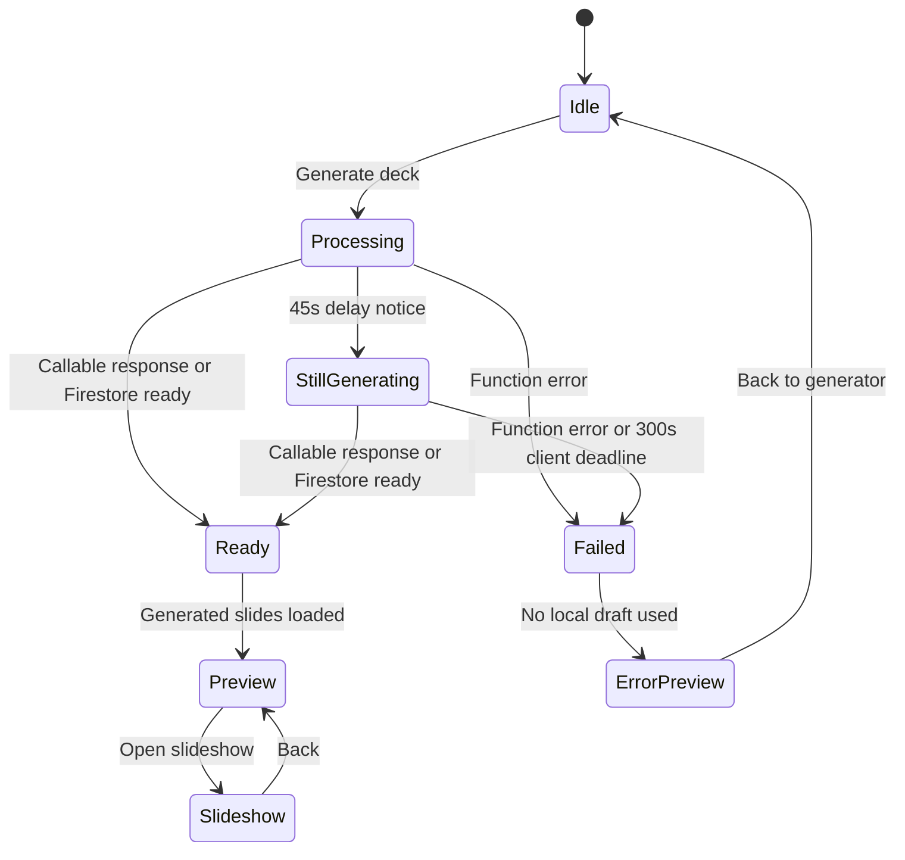
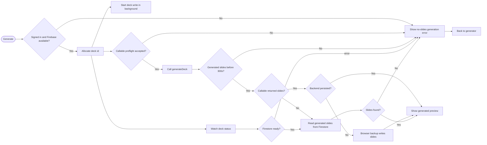

# AutoDeck AI Generation Workflow

This document describes the fixed deck generation workflow. The key rule is: the preview and slideshow use Firebase/Anthropic-generated slides only. Local parsing still happens in the browser, but local draft slides are not promoted as finished decks.

## What Changed

- The browser still parses `.txt` and `.pdf` locally, and sends parsed text to Firebase for AI generation.
- `handleGenerate` no longer seeds `slideshowSlides` with client-built draft slides.
- Slow generation no longer shows a finished "context draft" preview.
- After 45 seconds, the processing screen shows a delay notice but keeps waiting.
- The browser callable request timeout is explicitly set to 290 seconds so it stays below the 300 second Cloud Function limit.
- The frontend enforces a hard 300 second overall generation deadline from the moment the user clicks Generate, so Firestore setup, callable transport, and recovery reads cannot leave the user on processing forever.
- The frontend allocates a Firestore deck id immediately, starts the first deck write in the background, then calls `generateDeck` without waiting for that client write to acknowledge.
- The frontend watches the Firestore deck document for `status: ready` or `status: error`.
- The backend merge-writes generated slides to both the deck document and the `slides` subcollection, so it can create/update the deck even if the browser's first Firestore write is delayed.
- Backend Firestore persistence is non-fatal after Anthropic returns valid slides. If Admin Firestore returns an infrastructure error, the callable still returns generated slides to the browser with `persisted: false`.
- When `persisted: false` is returned, the signed-in browser performs a backup Firestore write before opening the preview.
- Optional original-source file upload to Firebase Storage is disabled by default. This avoids non-blocking local CORS noise after a successful deck; parsed text still goes to Firebase/Anthropic and generated slides still persist.
- `storage.cors.json` documents the bucket CORS policy required before re-enabling original-source uploads from localhost or Firebase Hosting.
- The deployed callable Cloud Run services allow public HTTP invocation for browser preflight, while every callable handler still requires Firebase Auth for the real request.
- Callable CORS explicitly allows localhost, 127.0.0.1, and the production Firebase Hosting domains.
- If generation fails, preview shows a no-slides error state that says no local draft was used.
- The sidebar shows build `gen-auth-2026-06-12`, and `window.AutoDeckBuild.id` exposes the same marker for stale-browser checks.
- The processing footer shows the Firestore deck id prefix, current generation stage, elapsed time, and seconds left before the hard stop.
- Parsed text cleanup removes repeated extraction units before sending source material to Anthropic.
- The Anthropic prompt now requires distinct synthesized slide titles instead of copied source headings.
- Backend normalization rejects duplicate slide titles or replaces them with a supported bullet-derived title.

## Fixed Workflow

1. User enters instructions and optionally uploads a file.
2. Browser parses local files into plain text where possible.
   - PDF/TXT text is cleaned to remove repeated headers, page labels, boilerplate, and duplicate extraction units.
3. User clicks `Generate deck`.
4. Frontend allocates a Firestore deck id and starts a background deck write with `status: processing`.
5. Frontend calls the `generateDeck` Cloud Function with `inputText`, `parsedFileText`, template settings, and deck id without waiting for the initial deck write to acknowledge.
6. Browser preflight is accepted by Cloud Run and CORS because the callable service has `roles/run.invoker` for `allUsers`.
7. Firebase callable auth is checked inside the handler; unsigned real requests return `UNAUTHENTICATED`.
8. Frontend stays on `ProcessingScreen` while generation is `loading`.
9. If generation takes more than 45 seconds, the UI shows a delay notice and continues waiting.
10. If the run does not return generated slides within 300 seconds, the frontend marks it as failed with no local fallback.
11. Cloud Function sends the parsed content to Anthropic.
12. Cloud Function normalizes the returned JSON slides.
   - Duplicate titles are replaced from slide evidence when possible, otherwise duplicate slides are dropped.
13. Cloud Function writes a `received-anthropic-response` heartbeat stage to Firestore, then immediately tries to merge-write deck-level slides and mark the deck `ready`. The slides subcollection batch write follows so the client's Firestore listener fires as early as possible.
14. If backend persistence fails after valid slides are generated, the function logs `generateDeck persistence failed` and returns the generated slides with `persisted: false` instead of throwing `internal`.
15. Frontend receives either the callable response or the Firestore `ready` update.
16. If the callable returns `persisted: false`, the browser does a signed-in backup write to `decks/{deckId}.slides` and `decks/{deckId}/slides`.
17. Optional source-file upload is skipped unless `localStorage["autodeck:sourceUploads"]` is set to `enabled` or `window.AutoDeckSourceUploadsEnabled = true`.
18. Frontend normalizes those Firebase/Anthropic-generated slides and opens preview.
19. User edits, opens slideshow, and exports from generated slide content.

## Root Causes Fixed On 2026-06-11

There were two separate failure layers.

First, a direct browser-equivalent preflight request to `generateDeck` returned HTTP 403 from Google Frontend before the callable handler ran. That meant no `generateDeck started` log could appear, and the web SDK surfaced the transport failure as `functions/internal`.

The deployed Cloud Run services now have public invoker permission:

- `generatedeck`
- `agentedit`
- `parsedocx`
- `parsepptx`

This is safe for the app's model because "public invoker" only lets the HTTP request reach the Firebase callable wrapper. The handlers still reject unsigned calls with `UNAUTHENTICATED`, and `generateDeck` still requires `request.auth` before using Anthropic or writing generated slides.

Second, after CORS/IAM was fixed, the signed-in callable reached Anthropic and parsed five generated slides successfully, then failed during Admin Firestore persistence with `5 NOT_FOUND`. That turned a valid Anthropic result into a frontend `internal` failure before any preview could open.

The generation path now treats that persistence failure as recoverable:

- `functions/index.js` logs `generateDeck persistence failed`.
- `generateDeck` still returns the Anthropic-generated slides to the client with `persisted: false`.
- `app/app.jsx` sees `persisted: false`, attempts a signed-in browser backup write, and then opens preview from the returned generated slides.

Verification after the fix:

- `OPTIONS https://us-central1-autodeck-ai.cloudfunctions.net/generateDeck` from `http://127.0.0.1:8083` returns `204` with `access-control-allow-origin`.
- Unsigned `POST` to the same callable returns `401` with `Sign in required`.
- A signed-in browser generation request reaches the handler, emits `generateDeck started`, and can show generated slides even if Admin Firestore persistence fails after Anthropic returns.
- Local generation no longer performs the optional Firebase Storage source-file upload by default, so successful runs do not show non-blocking Storage CORS errors.

## Auth And Local Hosting Update On 2026-06-12

Google sign-in now reports the underlying Firebase Auth reason instead of a generic failure. The login screen handles popup sign-in first, falls back to redirect when popup auth is blocked or unsupported, and processes redirect results when the browser returns.

If Google returns `auth/account-exists-with-different-credential`, AutoDeck stores the pending Google credential locally. The user can sign in once with the existing password account, and the app links that Google credential to the same Firebase user.

For local hosting, use `http://localhost:<port>/` for Google sign-in. Browsers may display the same local app at `127.0.0.1`, but Firebase Auth treats `127.0.0.1` and `localhost` as separate authorized domains. If a developer must use `127.0.0.1`, add it separately in Firebase Console → Authentication → Settings → Authorized domains.

## Optional Source File Uploads

The browser no longer uploads the original source file during normal generation. The AI workflow only needs the parsed text, and that parsed text is already sent to `generateDeck` and saved on the deck document.

To re-enable original-file uploads:

1. Apply `storage.cors.json` to the Firebase Storage bucket.
2. Enable uploads in the browser:

```js
localStorage.setItem('autodeck:sourceUploads', 'enabled');
location.reload();
```

If CORS is not applied first, Firebase Storage may show red `CORS error` rows in DevTools even when deck generation succeeds.

## Activity Diagram



## State Diagram



## Flowchart



## Implementation Notes

- `app/app.jsx` owns the generation run id, delay notice, immediate deck id allocation, callable invocation, and Firestore status listener.
- `app/app.jsx` enforces a hard overall client deadline because SDK/browser requests can otherwise stay pending longer than the Cloud Function timeout.
- `components/deck/ProcessingScreen.jsx` stays open while `generationStatus === 'loading'`.
- `components/deck/ProcessingScreen.jsx` shows the active deck id prefix, generation stage, elapsed time, and seconds left for Firestore/log inspection.
- `components/deck/PreviewScreen.jsx` only uses local/demo slides when opened directly in idle preview mode. Real generation errors do not fall back to demo or local draft slides.
- `functions/index.js` merge-writes generated slides on `decks/{deckId}.slides` and in `decks/{deckId}/slides`, so the generated content can be inspected directly in Firebase even if the browser's first deck write is delayed.
- `functions/index.js` returns generated slides with `persisted: false` when Admin Firestore persistence fails after Anthropic returns valid content.
- `app/app.jsx` performs the backup browser persistence path for `persisted: false` and still previews the generated slides.
- `app/app.jsx` skips optional original-file uploads by default; enable them only after applying `storage.cors.json` to the bucket.
- `components/deck/HomeScreenA.jsx` and `functions/index.js` both clean noisy parsed text; the backend remains authoritative because it re-cleans source material before prompting Anthropic.
- `components/shell/Sidebar.jsx` displays the build marker to confirm the loaded frontend is not stale.
- `components/auth/LoginScreen.jsx` maps Firebase Google sign-in errors to actionable messages, supports redirect fallback, and links pending Google credentials after password sign-in when Firebase reports an existing password account.
- `tests/generation-source.spec.js` covers the stale-banner absence, slow Firebase generation state, successful Firebase-slide preview, and failure-without-local-draft behavior.
